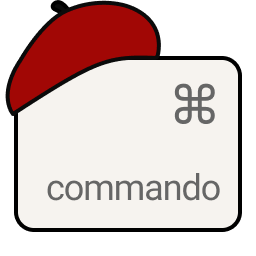
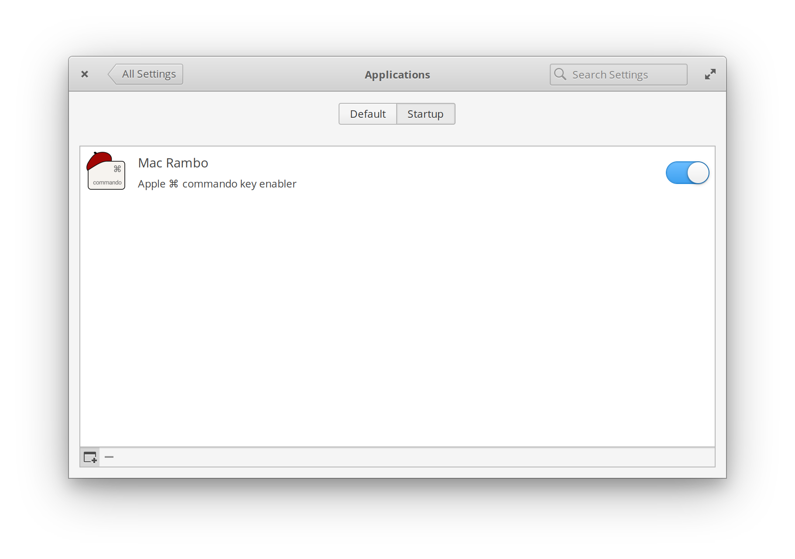
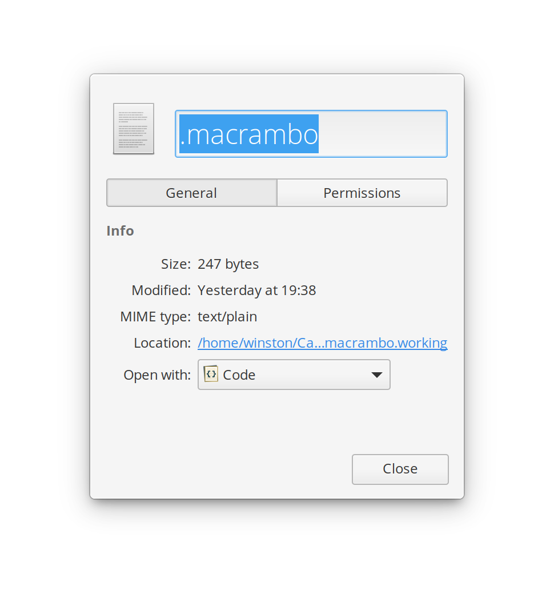
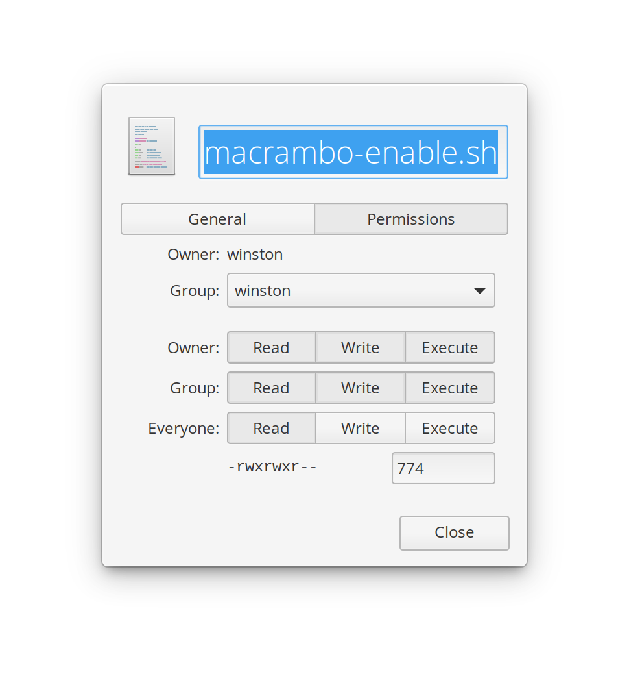

# Mac Rambo

### Apple ⌘ command key enabler

##### ~ _for macs running elementary Juno_

> "To all Earthlings running elementary Juno on a mac, I got your back."
 _- Mac Rambo_

 Mac Rambo enables you to use the ⌘ key normally in elmentary Juno, on a mac, on the regular, like a boss.

 ---

 This utility maps the ⌘ Apple command key to the ⌃ control key and vice versa, via xmodmap.

It basically turns the command key into a commando. A rebel commando: Mac Rambo. Spoken with a thick Scottish accent where the "a" is silent and the "o" is just a puff of air.

To instantly override Mac Rambo and revert to your old control key issues, simply open System Settings > Keyboard. You're on your own now.

#### 1. Install
In this folder, right click on the background and select Open in Terminal. Do:

    ./macrambo-install.sh

#### 2. Enable
Restart- or in your home folder, right click on the file macrambo-enable.sh and in the contextual menu, select the top option: Run.

#### 3. Use the ⌘ key
You should now be able to copy, paste, undo, scroll zoom, open, save, yea basically everything, using the Apple ⌘ command key. Welcome home.

#### Startup

1.Mac Rambo is installed as a Startup item at System Settings > Applications > Startup  

---

#### 1. Disable

Simply open System Settings > Keyboard to override Mac Rambo and enjoy the control key in all of its sinister, herniated fingerdom and rude reach-over, asymmetrical imbalance- especially for lefties.

#### 2. Uninstall

    ./macrambo-uninstall.sh

#### 3. Trash

Go to ~/Utilities and Trash Mac Rambo.  

#### Problems?
 - See Troubleshooting below

---

#### Install the hard way

1. Copy .macrambo to your home folder
1. Copy macrambo-enable.sh to your home folder
1. Copy macrambo.desktop to ~/.config/autostart/
1. Copy macrambo.png to ~/.local/share/icons/hicolor/128x128/apps/
1. Copy this folder to Utilities. No Utilities folder? Make it ur own dang self.

Problems? If you can't see the .config or .local folders: in your home folder, right click and check Show Hidden Files.  

__Note__: When creating shorts cuts in System Settings > Keyboard, use the control key to set a shortcut for the command key, then remember to rerun the script after you close out.  For instance, set the Systems > Applications Menu to activate with control spacebar.  Close out of System Settings, restart or run the script again, and command spacebar will open the Applications Menu.

---

#### Troubleshooting

__Remember__, if you open System Settings > Keyboard, _you will need to rerun the script by doing the above step 2 again_ AFTER you close System Settings.

Permissions

- In your home folder, right click on the file .macrambo, in the contextual menu select Properties, then in the dialogue box select Permissions, and set permissions to match those below by clicking in the grid or typing numbers in the bottom right box

 (Owner and Group will show your name, not mine)

- In your home folder, right click on the file macrambo.sh and just as you did above, and match permissions to those in the image below:

 (Owner and Group will show your name, not mine)

---

#### Mac Rambo works on these macs:

- [iMac 21.5 inch (Retina 4K, 21.5-inch, 2017)](https://support.apple.com/kb/SP759)
    - magic keyboard

- [MacBook Pro 15 inch (Retina, Mid 2012) model a1378](https://support.apple.com/kb/SP653?locale=en_US)

---

Find your model:

- [MacBook Models](https://support.apple.com/en-gb/HT201300)

- [iMac Models](https://support.apple.com/en-us/HT201634)

- [Find your model by serial](https://checkcoverage.apple.com/)

And post an issue if Mac Rambo works on your mac or not.

---

Mad Credit: [Alex Palcuie](https://askubuntu.com/questions/131900/how-do-i-switch-the-command-key-and-control-key-on-a-macbo)
